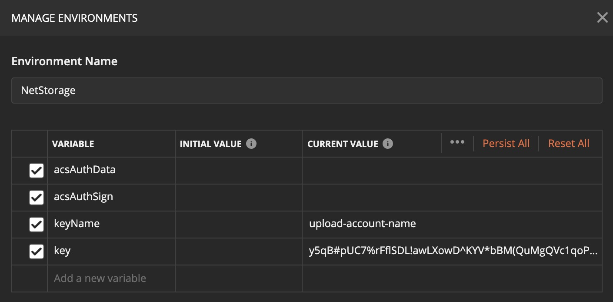
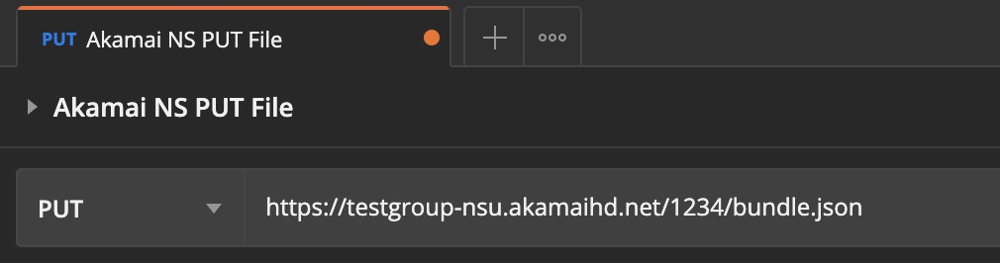
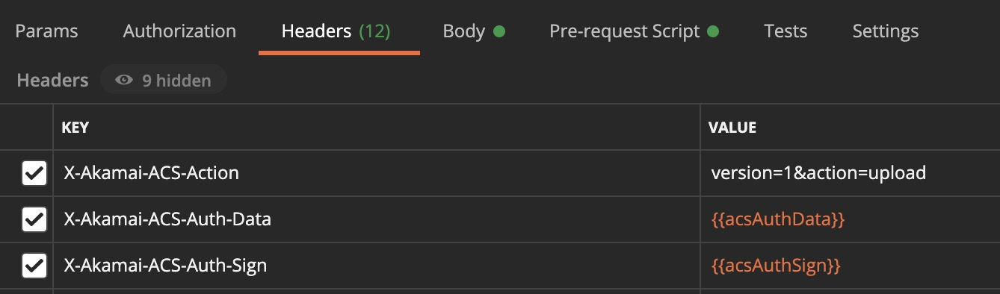

# Akamai Netstorage (NS4) API for Postman
Enables the authorization for Akamai's NetStorage API through environment variables and pre-request script.

## Important
Akamai does not maintain or regulate this package. While it can be incorporated to assist you in API use, Akamai Technical Support will not offer assistance and Akamai cannot be held liable if issues arrise from its use. 

## Requirements
* Postman
* NS4 Storage Group Provided
* NS Upload Account with API Access enabled

## Postman Setup

### Environment
1. Add a new [Postman Environment](https://learning.postman.com/docs/sending-requests/managing-environments/)

2. Add the following environment variable names. Keep the names exactly the same as the pre-request script will look for those names.
    * `acsAuthData` (keep it empty)
    * `acsAuthSign` (keep it empty)
    * `keyName` (add the upload account name under "CURRENT VALUE")
    * `key` (add the NS Upload Account API Key under "CURRENT VALUE")

### Request
1. Create a new [Postman Request](https://learning.postman.com/docs/sending-requests/requests/)
    * Select the appropriate method (GET, POST, PUT) 
    * For the hostname use the NS API hostname, which should look like *-nsu.akamaihd.net
    * Add the path to the folder or file

2. Under Headers add the following:
    * `X-Akamai-ACS-Action: version=1&action=upload`
        The action value can be modified to any of the [Available Actions by NS4](https://learn.akamai.com/en-us/webhelp/netstorage/netstorage-http-api-developer-guide/GUID-22B017EE-DD73-4099-B96D-B5FD91E1ED98.html).
    * `X-Akamai-ACS-Auth-Data: {{acsAuthData}}`
        Observe we're pointing the value to the actual environment variable that will contain the value.
    * `X-Akamai-ACS-Auth-Sign: {{acsAuthSign}}`
        Observe we're pointing the value to the actual environment variable that will contain the value.

3. Add the netstorage-api-postman.js contents under "Pre-request Script"

4. Send the request.

#### Example: Upload a File

1. Select PUT as the method. 

2. The request URL path must include the name of the file to upload. In this case the file is named bundle.json
    `https://test-nsu.akamaihd.net/1234/bundle.json`

3. In the body section select "form-data" and "File" from the KEY field. Point it to your file to upload.

For any other use case like listing a directory, deleting a file, updating a file, etc make sure to properly adjust the method, URL, body and action parameters.
